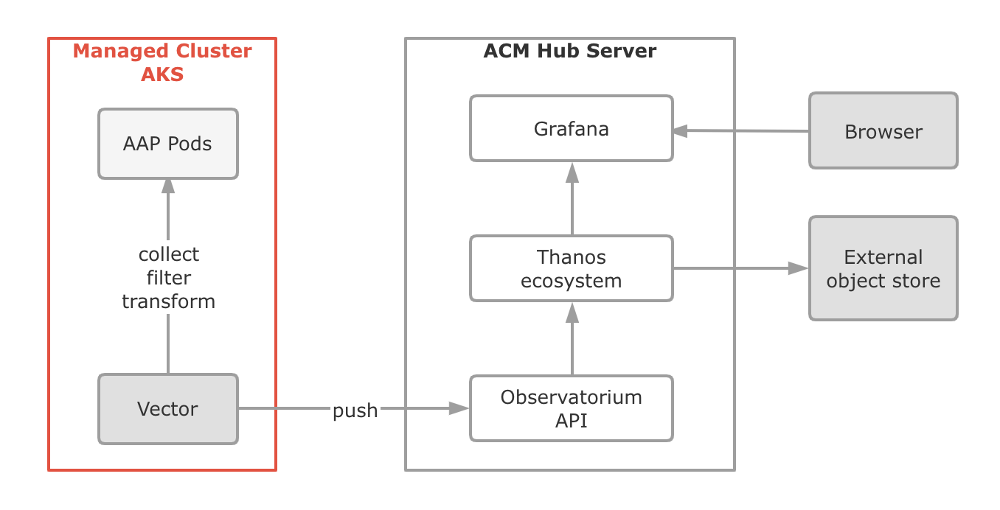
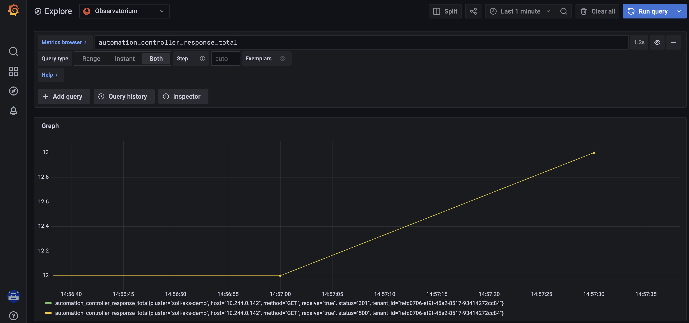
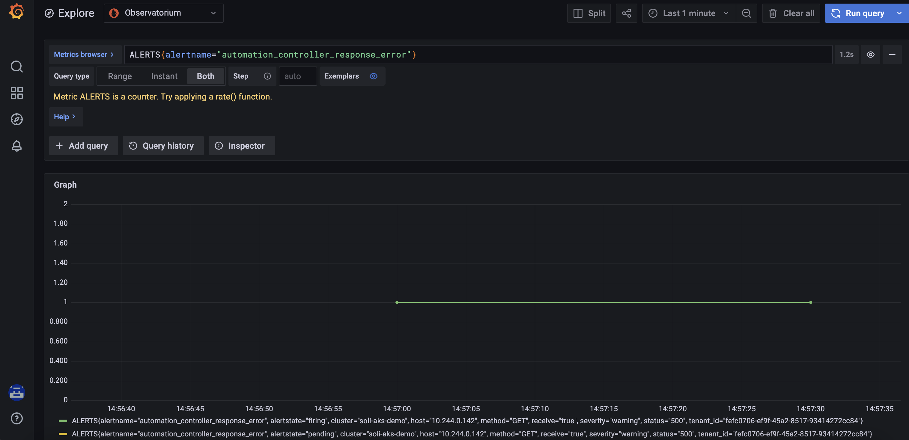

# Vector

This application will deploy the [Vector]() to your managedcluster, then you can collect Pod log events and push them to ACM Hub. We use this repo to provide a solution to collect AAP Pods logs from AKS managedclusters. so we setup a default configuration for Vector. when installing the Vector with the default configuration. Vector will collect the AAP Pods `automation-controller` log (Apache format) and push them to ACM Hub.



# Prerequisites

- Enable the observability service in ACM Hub
- Import your managedcluster to ACM Hub and enable observability service

# Pre-install

## Fetch the TLS configuration from ACM observability service

The Vector needs to push the log from managedcluster to ACM Hub, so we need to configure the TLS options for outgoing connections. Log in to the ACM Hub cluster, run the following command to fetch the client certificate:

```
oc get secret -n open-cluster-management-addon-observability observability-controller-open-cluster-management.io-observability-signer-client-cert -o jsonpath="{.data.tls\.crt}" | base64 -d > tls.crt
```

```
oc get secret -n open-cluster-management-addon-observability observability-controller-open-cluster-management.io-observability-signer-client-cert -o jsonpath="{.data.tls\.key}" | base64 -d > tls.key
```

Run the following command to fetch the CA certificate:

```
oc get secret -n open-cluster-management-addon-observability observability-managed-cluster-certs -o jsonpath="{.data.ca\.crt}" | base64 -d > ca.crt
```

## [Configure the Vector](https://vector.dev/docs/reference/configuration/)

- configure the sink `prometheus_remote_write` endpoint

    ACM Hub exposes a `prometheus_remote_write` endpoint, we can push the metrics to this endpoint and then store metrics in ACM Hub, run the following command to get endpoint, and then copy it to replace `__ACM_OBSERVATORIUM_API_HOST__` field in `agent.yaml`:

    ```
    oc get route -n open-cluster-management-observability observatorium-api -o jsonpath="{.spec.host}"
    ```

- configure the log metric tags

    To replace `__CLUSTER_NAME__` field in `agent.yaml`, then you can know this log metric is from which managedclusters

- configure the `extra_label_selector` field in `agent.yaml` to collect the special Pod logs

    By default, `extra_label_selector` is set to `app.kubernetes.io/name=automation-controller`, so the Vector will to collect the Pod logs if the Pod has this label.

- configure transforms to filter, transform and convert the log

    By default, we just collect the `standard apache format` log from Pod, and remove the log if the status is `200`, For example, Pod should have the following logs:
    
    ```
    10.244.0.142 - admin [24/Jan/2022:13:49:58 +0000] "GET /api/v2/metrics HTTP/1.1" 500 0 "-" "Prometheus/2.26.1" "-"
    10.244.0.142 - admin [24/Jan/2022:13:50:58 +0000] "GET /api/v2/metrics HTTP/1.1" 200 0 "-" "Prometheus/2.26.1" "-"
    10.244.0.142 - admin [24/Jan/2022:13:51:01 +0000] "GET /api/v2/metrics HTTP/1.1" 301 0 "-" "Prometheus/2.26.1" "-"
    10.244.0.142 - admin [24/Jan/2022:13:51:04 +0000] "GET /api/v2/metrics HTTP/1.1" 500 0 "-" "Prometheus/2.26.1" "-"
    10.244.0.142 - admin [24/Jan/2022:13:52:04 +0000] "GET /api/v2/metrics HTTP/1.1" 200 0 "-" "Prometheus/2.26.1" "-"
    ```

    You can also configure the transforms to collect the other format log. For more detail please see: https://vector.dev/docs/reference/configuration/transforms/

# Deploying this Application

Run the following command to deploy this application:

```
$ oc create ns vector
$ oc apply -n vector -k ./vector
```

# Post-install

If we successfully deployed the Vector on managedcluster, you can create custom rules on ACM Hub cluster via ACM observability service custom rules feature. For example, we provide a sample to detect the `500` error:

```
kind: ConfigMap
apiVersion: v1
metadata:
  name: thanos-ruler-custom-rules
  namespace: open-cluster-management-observability
data:
  custom_rules.yaml: |
    groups:
    - name: automation-controller-web-health
      rules:
      - alert: automation_controller_response_error
        expr: automation_controller_response_total{status="500"} > 3
        for: 1m
        labels:
          severity: warning
```

If the total response for `500` status is greater than `3` in `1` minute, ACM Hub will generate an alert for this error log, then we can know which Pods go wrong from the AKS cluster. For more detail about custom rules please see: https://access.redhat.com/documentation/en-us/red_hat_advanced_cluster_management_for_kubernetes/2.4/html/observability/observing-environments-intro#creating-custom-rules

If Pod has some error log, you should get the following metric and alert from ACM Hub Grafanan console:




